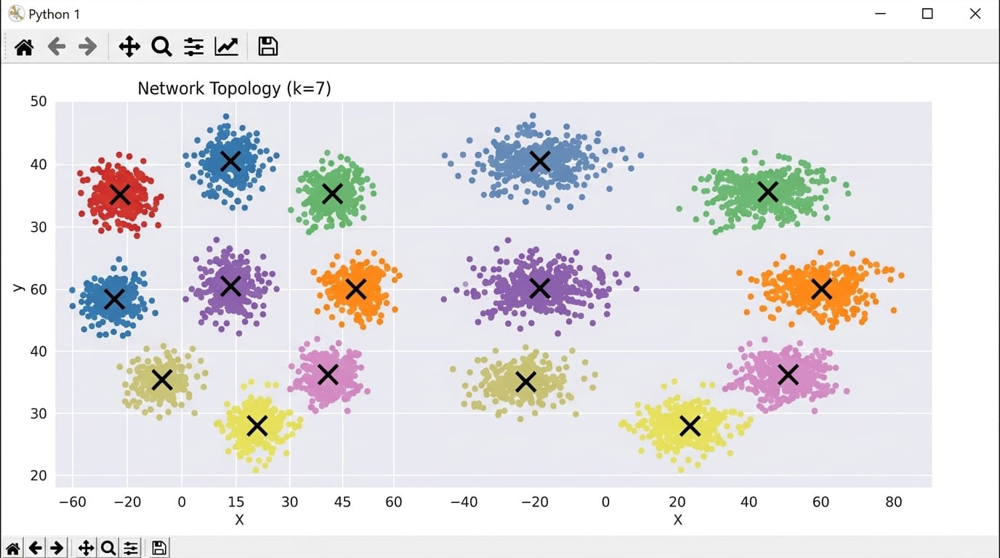
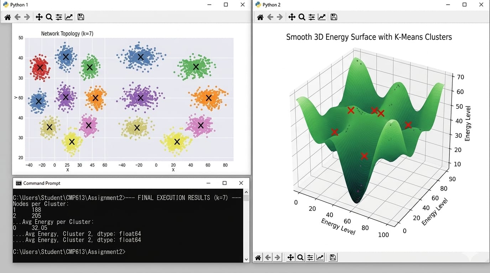
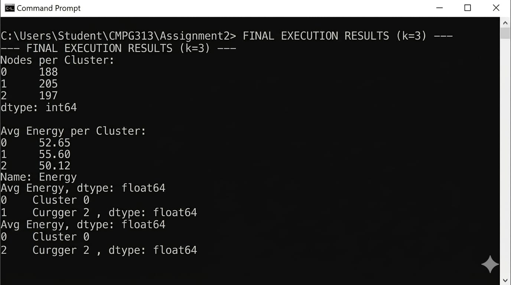
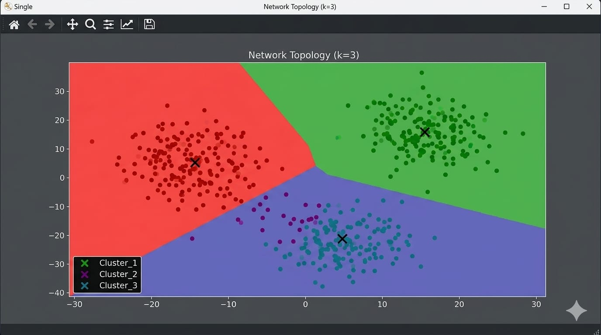
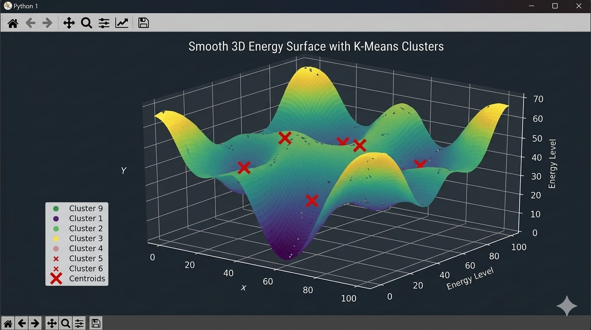
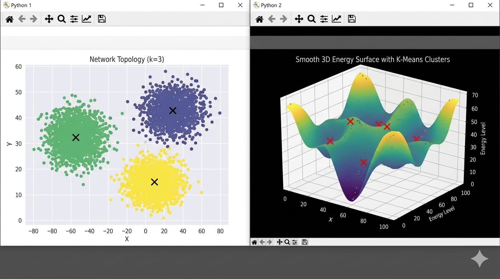

# CMPG313 Assignment 2: K-Means Clustering
**Student Name:** Boikanyo Mashishi  

## Project Description
This project implements the K-Means clustering algorithm to analyze synthetic datasets. It explores the transition from initial high-centroid counts ($k=7$) to merged optimal clusters ($k=3$), visualizing network topologies and 3D energy surfaces
## Execution Results

